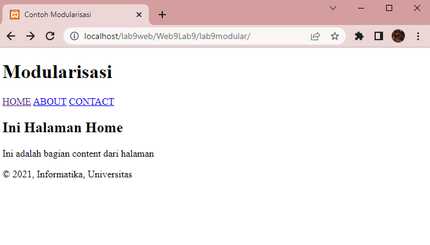
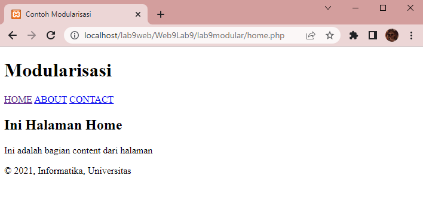
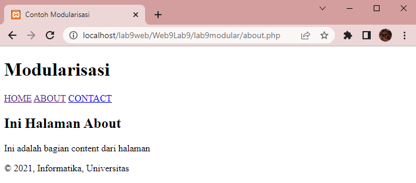

# Web9Lab9

**Nama    : Aning Kinanti** <br>
**NIM     : 312010364** <br>
**Kelas   : TI.20.A2** <br>
**Matkul  : Pemrograman Web** <br>

# Belajar PHP Modular
1. Pastikan Xampp sudah terinstall dan server dapat berjalan dengan baik http://127.0.0.1 atau http://localhost
2. Tempatkan file website tempatkan di direktori: \xampp\htdocs\

## A. Modularisasi Program
### 1. Membuat File Header Php
Buatlah dokumen PHP dengan nama `header.php` seperti contoh dibawah ini : <br>
```
<!DOCTYPE html>
<html lang="en">
<head>
    <meta charset="UTF-8">
    <meta http-equiv="X-UA-Compatible" content="IE=edge">
    <meta name="viewport" content="width=device-width, initial-scale=1.0">
    <link href="style.css" rel="stylesheet" type="text/stylesheet" media="screen" />
    <title>Contoh Modularisasi</title>
</head>
<body>
    <div class="container">
        <header>
            <h1>Modularisasi</h1>
        </header>
        <nav>
            <a href="home.php">HOME</a>
            <a href="about.php">ABOUT</a>
            <a href="kontak.php">CONTACT</a>
        </nav>
```
<br>

### 2. Membuat File Footer Php
Buatlah file PHP baru dengan nama `footer.php` seperti contoh dibawah ini : <br>
```
        <footer>
            <p>&copy; 2021, Informatika, Universitas 
        </footer>
    </div>
</body>
</html>
```
<br>

### 3. Membuat File Home Php
Buatlah file PHP baru dengan nama `home.php` seperti contoh dibawah ini : <br>
```
<?php require('header.php'); ?>

<div class="content">
    <h2>Ini Halaman Home</h2>
    <p>Ini adalah bagian content dari halaman</p>
</div>

<?php require('footer.php'); ?>
```
<br>

### 4. Membuat File About Php
Buatlah file PHP baru dengan nama `about.php` seperti contoh dibawah ini : <br>
```
<?php require('header.php'); ?>

<div class="content">
    <h2>Ini Halaman About</h2>
    <p>Ini adalah bagian content dari halaman</p>
</div>

<?php require('footer.php'); ?>
```
<br>

Kemudian untuk mengakses hasilnya melalui URL: http://localhost/lab9web/Web9Lab9/lab9modular/ <br>
Ini adalah hasil halaman utama dari sintaks diatas :
 <br>

Kemudian apabila menu  `HOME` diklik maka akan tetap pada halaman utama, karena halaman utama adalah menu home. <br>
Berikut adalah hasilnya :
 <br>

Lalu apabila menu  `ABOUT` diklik maka akan pindah ke menu about. <br>
Berikut adalah hasilnya :
 <br>