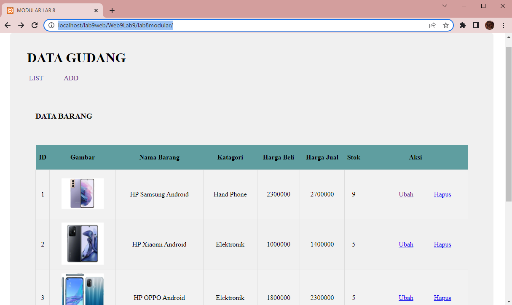
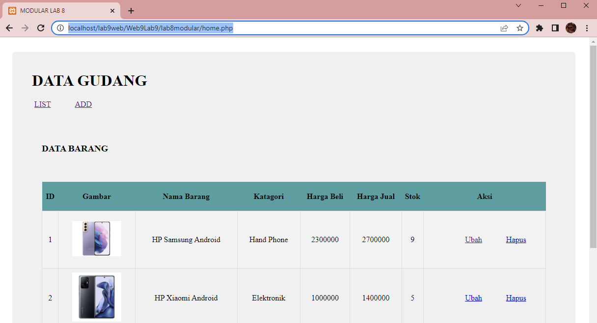
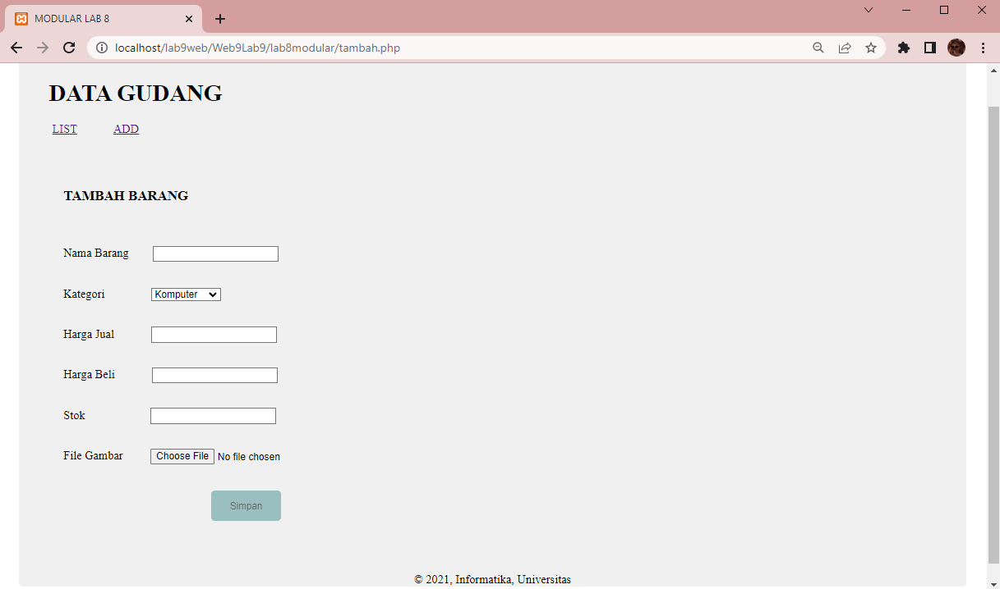
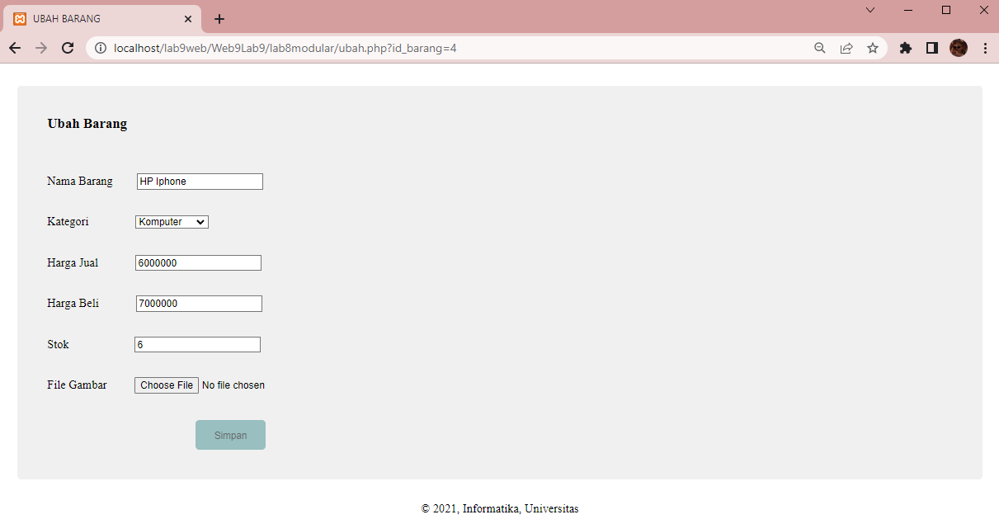

# Web9Lab9

**Nama    : Aning Kinanti** <br>
**NIM     : 312010364** <br>
**Kelas   : TI.20.A2** <br>
**Matkul  : Pemrograman Web** <br>

# Belajar PHP Modular
1. Pastikan Xampp sudah terinstall dan server dapat berjalan dengan baik http://127.0.0.1 atau http://localhost
2. Tempatkan file website tempatkan di direktori: \xampp\htdocs\

## A. Modularisasi Program
### 1. Membuat File Header Php
Buatlah dokumen PHP dengan nama `header.php` seperti contoh dibawah ini : <br>
```
<!DOCTYPE html>
<html lang="en">
<head>
    <meta charset="UTF-8">
    <meta http-equiv="X-UA-Compatible" content="IE=edge">
    <meta name="viewport" content="width=device-width, initial-scale=1.0">
    <link href="style.css" rel="stylesheet" type="text/stylesheet" media="screen" />
    <title>Contoh Modularisasi</title>
</head>
<body>
    <div class="container">
        <header>
            <h1>Modularisasi</h1>
        </header>
        <nav>
            <a href="home.php">HOME</a>
            <a href="about.php">ABOUT</a>
            <a href="kontak.php">CONTACT</a>
        </nav>
```
<br>

### 2. Membuat File Footer Php
Buatlah file PHP baru dengan nama `footer.php` seperti contoh dibawah ini : <br>
```
        <footer>
            <p>&copy; 2021, Informatika, Universitas 
        </footer>
    </div>
</body>
</html>
```
<br>

### 3. Membuat File Home Php
Buatlah file PHP baru dengan nama `home.php` seperti contoh dibawah ini : <br>
```
<?php require('header.php'); ?>

<div class="content">
    <h2>Ini Halaman Home</h2>
    <p>Ini adalah bagian content dari halaman</p>
</div>

<?php require('footer.php'); ?>
```
<br>

### 4. Membuat File About Php
Buatlah file PHP baru dengan nama `about.php` seperti contoh dibawah ini : <br>
```
<?php require('header.php'); ?>

<div class="content">
    <h2>Ini Halaman About</h2>
    <p>Ini adalah bagian content dari halaman</p>
</div>

<?php require('footer.php'); ?>
```
<br>

Kemudian untuk mengakses hasilnya melalui URL: http://localhost/lab9web/Web9Lab9/lab9modular/ <br>
Ini adalah hasil halaman utama dari sintaks diatas :
 <br>

Kemudian apabila menu  `HOME` diklik maka akan tetap pada halaman utama, karena halaman utama adalah menu home. <br>
Berikut adalah hasilnya :
 <br>

Lalu apabila menu  `ABOUT` diklik maka akan pindah ke menu about. <br>
Berikut adalah hasilnya :
 <br>

## B. Pertanyaan dan Tugas
Implementasikan konsep modularisasi pada kode program praktikum 8 tentang database, sehingga setiap halamannya memiliki template tampilan yang sama ! <br>

Pisahkan header footer dan content program lab8 yang telah dibuat. <br>

### 1. Membuat File Header Php Lab 8
Buatlah file header terlebih dahulu dengan nama `header.php` lalu isi dengan sintaks seperti dibawah ini : <br>
```
<!DOCTYPE html>
<html lang="en">
<head>
    <meta charset="UTF-8">
    <meta http-equiv="X-UA-Compatible" content="IE=edge">
    <meta name="viewport" content="width=device-width, initial-scale=1.0">
    <link href="style.css" rel="stylesheet" type="text/stylesheet" media="screen" />
    <title>MODULAR LAB 8</title>
</head>
<body>
    <div class="container">
        <header>
            <h1>DATA GUDANG</h1>
        </header>
        <nav>
            <a href="home.php">LIST</a>
            <a href="tambah.php">ADD</a>
        </nav>        
```
<br>

### 2. Membuat File Footer Php Lab 8
Buatlah file footer terlebih dahulu dengan nama `footer.php` lalu isi dengan sintaks seperti dibawah ini : <br>
```
        <footer>
            <p>&copy; 2021, Informatika, Universitas 
        </footer>
    </div>
</body>
</html>   
```
<br>

### 3. Membuat File Home Php Lab 8
Buatlah file home (utama) terlebih dahulu dengan nama `home.php` lalu isi dengan sintaks seperti dibawah ini : <br>
```
<?php require('header.php'); ?>

<?php
    include("koneksi.php");
    // query untuk menampilkan data
    $sql = 'SELECT * FROM data_barang';
    $result = mysqli_query($conn, $sql);
?>

<!DOCTYPE html>
<html lang="en">
<head>
    <meta charset="UTF-8">
    <meta http-equiv="X-UA-Compatible" content="IE=edge">
    <meta name="viewport" content="width=device-width, initial-scale=1.0">
    <link href="style_index.css" rel="stylesheet" type="text/css" />
    <title>DATA BARANG</title>
</head>
<body>
    <div class="container">
        <h3>DATA BARANG</h3>
        <br>
        <div class="main">
            <table>
            <tr>
                <th>ID</th>
                <th>Gambar</th>
                <th>Nama Barang</th>
                <th>Katagori</th>
                <th>Harga Beli</th>
                <th>Harga Jual</th>
                <th>Stok</th>
                <th>Aksi</th>
            </tr>
            <?php if($result): ?>
            <?php while($row = mysqli_fetch_array($result)): ?>
            <tr>
                <td><?= $row['id_barang'];?></td>
                <td>" alt="<?= $row['nama']; ?>" width="100"></td>
                <td><?= $row['nama'];?></td>
                <td><?= $row['kategori'];?></td>
                <td><?= $row['harga_beli'];?></td>
                <td><?= $row['harga_jual'];?></td>
                <td><?= $row['stok'];?></td>
                <td>
                    <a class="ubah" href="ubah.php?id_barang=<?php echo $row['id_barang']; ?>">Ubah</a>
                    <a class="hapus" href="hapus.php?id_barang=<?php echo $row['id_barang']; ?>">Hapus</a>
                </td>
            </tr>
            <?php endwhile; else: ?>
            <tr>
                <td colspan="7">Belum ada data</td>
            </tr>
            <?php endif; ?>
            </table>
        </div>
    </div>
</body>
</html>


<?php require('footer.php'); ?>
```
<br>

### 4. Membuat File Tambah (Create) Php Lab 8
Buatlah file tambah terlebih dahulu dengan nama `tambah.php` lalu isi dengan sintaks seperti dibawah ini : <br>
```
<?php require('header.php'); ?>

<?php
error_reporting(E_ALL);
include_once 'koneksi.php';
if (isset($_POST['submit'])) {
  $nama = $_POST['nama'];
  $kategori = $_POST['kategori'];
  $harga_jual = $_POST['harga_jual'];
  $harga_beli = $_POST['harga_beli'];
  $stok = $_POST['stok'];
  $file_gambar = $_FILES['file_gambar'];
  $gambar = null;
  if ($file_gambar['error'] == 0) {
    $filename = str_replace(' ', '_', $file_gambar['name']);
    $destination = dirname(__FILE__) . '/gambar/' . $filename;
    if (move_uploaded_file($file_gambar['tmp_name'], $destination)) {
      $gambar =  $filename;;
    }
  }
  $sql = 'INSERT INTO data_barang (nama, kategori,harga_jual, harga_beli, stok, gambar) ';
  $sql .= "VALUE ('{$nama}', '{$kategori}','{$harga_jual}', '{$harga_beli}', '{$stok}', '{$gambar}')";
  $result = mysqli_query($conn, $sql);
  
  header('location: home.php');
}
?>

<!DOCTYPE html>
<html lang="en">
<head>
    <meta charset="UTF-8">
    <meta http-equiv="X-UA-Compatible" content="IE=edge">
    <meta name="viewport" content="width=device-width, initial-scale=1.0">
    <link href="style_tambah.css" rel="stylesheet" type="text/css" />
    <title>TAMBAH BARANG</title>
</head>
<body>
    <div class="container">
        <h3>TAMBAH BARANG</h3>
        <div class="main">
            <form method="post" action="tambah.php" enctype="multipart/form-data">
                <div class="input">
                    <label>Nama Barang</label>
                    <input class="nama" type="text" name="nama"/>
                </div>
                <div class="input">
                    <label>Kategori</label>
                    <select class="kategori" name="kategori">
                        <option value="Komputer">Komputer</option>
                        <option value="Elektronik">Elektronik</option>
                        <option value="Handphone">Handphone</option>
                    </select>
                </div>
                <div class="input">
                    <label>Harga Jual</label>
                    <input class="harga_jual" type="text" name="harga_jual"/>
                </div>
                <div class="input">
                    <label>Harga Beli</label>
                    <input class="harga_beli" type="text" name="harga_beli"/>
                </div>
                <div class="input">
                    <label>Stok</label>
                    <input class="stok" type="text" name="stok"/>
                </div>
                <div class="input">
                    <label>File Gambar</label>
                    <input class="file" type="file" name="file_gambar"/>
                </div>
                <div class="submit">
                    <input class="button" type="submit" name="submit" value="Simpan"/>
                </div>
            </form>
        </div>
    </div> 
</body>
</html>

<?php require('footer.php'); ?>
```
<br>

### 5. Membuat File ubah Php Lab 8
Buatlah file ubah terlebih dahulu dengan nama `ubah.php` lalu isi dengan sintaks seperti dibawah ini : <br>
```
<?php
    error_reporting(E_ALL);
    include_once 'koneksi.php';

    if (isset($_POST['submit']))
    {
        $id = $_POST['id'];
        $nama = $_POST['nama'];
        $kategori = $_POST['kategori'];
        $harga_jual = $_POST['harga_jual'];
        $harga_beli = $_POST['harga_beli'];
        $stok = $_POST['stok'];
        $file_gambar = $_FILES['file_gambar'];
        $gambar = null;
    
        if ($file_gambar['error'] == 0)
        {
            $filename = str_replace(' ', '_', $file_gambar['name']);
            $destination = dirname(__FILE__) . '/gambar/' . $filename;
            if (move_uploaded_file($file_gambar['tmp_name'], $destination))
            {
            $gambar = 'gambar/' . $filename;;
            }
        }
        $sql = 'UPDATE data_barang SET ';
        $sql .= "nama = '{$nama}', kategori = '{$kategori}', ";
        $sql .= "harga_jual = '{$harga_jual}', harga_beli = '{$harga_beli}', stok = '{$stok}' ";

        if (!empty($gambar))

        $sql .= ", gambar = '{$gambar}' ";
        $sql .= "WHERE id_barang = '{$id}'";
        $result = mysqli_query($conn, $sql);

        header('location: home.php');
    }
    $id_barang = $_GET['id_barang'];
    $sql = "SELECT * FROM data_barang WHERE id_barang = '{$id_barang}'";
    $result = mysqli_query($conn, $sql);
    if (!$result) die('Error: Data tidak tersedia');
    $data = mysqli_fetch_array($result);

    function is_select($var, $val) {
        if ($var == $val) return 'selected="selected"';
        return false;
    }
?>

<!DOCTYPE html>
<html lang="en">
<head>
    <meta charset="UTF-8">
    <meta http-equiv="X-UA-Compatible" content="IE=edge">
    <meta name="viewport" content="width=device-width, initial-scale=1.0">
    <link href="style_ubah.css" rel="stylesheet" type="text/css" />
    <title>UBAH BARANG</title>
</head>
<body>
    <div class="container">
        <h3>Ubah Barang</h3>
        <div class="main">
            <form method="post" action="ubah.php" enctype="multipart/form-data">
                <div class="input">
                    <label>Nama Barang</label>
                    <input class="nama" type="text" name="nama" value="<?php echo $data['nama'];?>" />
                </div>
                <div class="input">
                    <label>Kategori</label>
                    <select name="kategori" class="kategori">
                        <option <?php echo is_select('Komputer', $data['kategori']);?> value="Komputer">Komputer</option>
                        <option <?php echo is_select('Komputer', $data['kategori']);?> value="Elektronik">Elektronik</option>
                        <option <?php echo is_select('Komputer', $data['kategori']);?> value="Hand Phone">Hand Phone</option>
                    </select>
                </div>
                <div class="input">
                    <label>Harga Jual</label>
                    <input class="harga_jual" type="text" name="harga_jual" value="<?php echo $data['harga_jual'];?>" />
                </div>
                <div class="input">
                    <label>Harga Beli</label>
                    <input class="harga_beli" type="text" name="harga_beli" value="<?php echo $data['harga_beli'];?>" />
                </div>
                <div class="input">
                    <label>Stok</label>
                    <input class="stok" type="text" name="stok" value="<?php echo $data['stok'];?>" />
                </div>
                <div class="input">
                    <label>File Gambar</label>
                    <input class="file" type="file" name="file_gambar" />
                </div>
                <div class="submit">
                <input type="hidden" name="id" value="<?php echo $data['id_barang'];?>" />
                    <input class="button" type="submit" name="submit" value="Simpan" />
                </div>
            </form>
        </div>
    </div>
</body>
</html>

<?php require('footer.php'); ?>
```
<br>

Lalu copy semua file css dan file `koneksi.php` yang telah dibuat sebelumnya, dan folder gambar yang telah disiapkan sebelumnya seperti pada lab8. <br>

Kemudian untuk mengakses hasilnya melalui URL: http://localhost/lab9web/Web9Lab9/lab8modular/ <br>
Ini adalah hasil halaman utama (HOME) dari sintaks diatas :
 <br>

Kemudian apabila menu `LIST` diklik maka akan tetap pada halaman utama, karena halaman utama adalah menu list. <br>
Berikut adalah hasilnya :
 <br>

Lalu apabila menu `ADD` diklik maka akan pindah ke menu tambah. <br>
Berikut adalah hasilnya :
 <br>

Dan apabila menu `ubah` diklik maka akan pindah ke menu ubah. <br>
Berikut adalah hasilnya :
 <br>